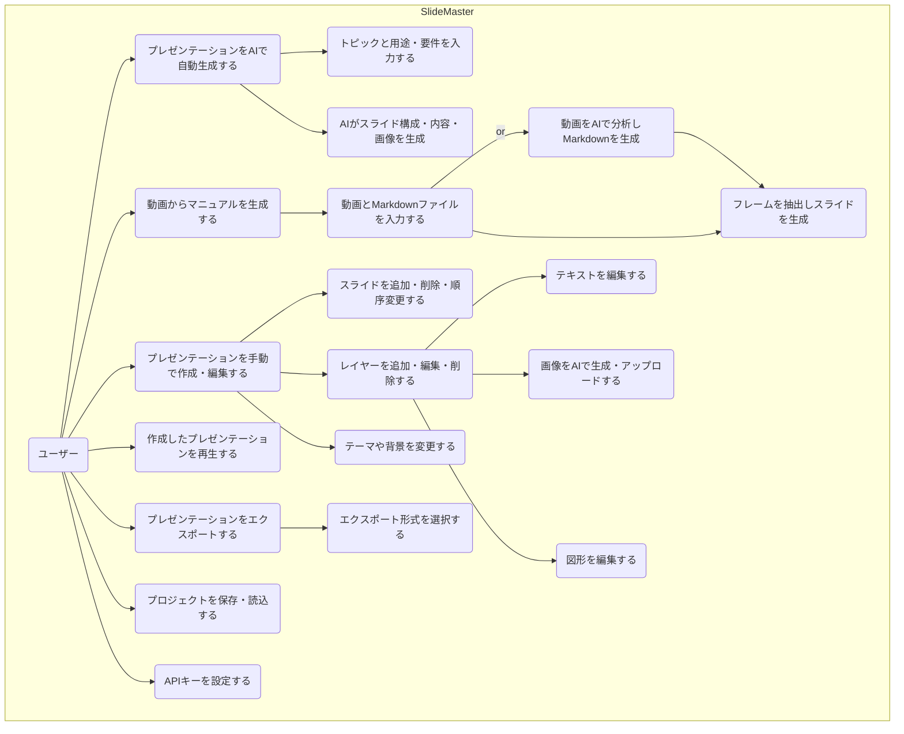

# 1. 要件定義書 - SlideMaster

## 1.1. 概要

本ドキュメントは、AIプレゼンテーション作成ツール「SlideMaster」の要件を定義するものです。

## 1.2. プロジェクトの目的

SlideMasterは、マルチAIプロバイダー対応により、ユーザーが簡単な指示（トピック）や既存のコンテンツ（動画、Markdown）を入力するだけで、AIが自動的に構成、テキスト、デザイン、画像を生成し、高品質なプレゼンテーションを作成することを目的としたWebアプリケーションです。Gemini、Azure、OpenAI、Claude、LM Studio、Fooucusなど複数のAIプロバイダーを統合し、用途に応じて最適なAIを選択できます。また、高度な手動編集機能も提供し、AIによる自動生成とユーザーによる自由なカスタマイズの完全な両立を実現します。

## 1.3. ターゲットユーザー

### 1.3.1. プライマリーユーザー
- **ビジネスプロフェッショナル**: 効率的なプレゼンテーション作成を求める企業関係者
- **教育関係者**: 授業用資料や研修コンテンツを作成する教師・講師
- **企業研修担当者**: 操作マニュアルやトレーニング資料を作成する担当者
- **コンテンツクリエーター**: ビジュアルコンテンツを効率的に制作したいクリエーター

### 1.3.2. セカンダリーユーザー
- **学生・研究者**: 学術発表や卒業論文発表用の資料を作成する学生
- **マーケティング担当者**: 商品紹介や企画提案用のプレゼンテーションを作成する担当者
- **フリーランス**: クライアント向けの提案書や報告書を作成する個人事業主
- **NPO・団体関係者**: 活動報告や資金調達用のプレゼンテーションを作成する団体職員

### 1.3.3. 特殊用途ユーザー
- **子供向けコンテンツ制作者**: 絵本や教育コンテンツを作成する保護者・教育者
- **動画マニュアル制作者**: 操作動画を基にしたステップバイステップガイドを作成する担当者
- **多言語対応担当者**: 国際的なプレゼンテーション資料を作成する担当者

## 1.4. 機能要件

### 1.4.1. コア機能

- **マルチAIプロバイダー対応によるプレゼンテーション自動生成**:
    - **6種類のAIプロバイダー対応**: Gemini、Azure OpenAI、OpenAI、Claude、LM Studio、Fooocus
    - **16種類のテキスト生成モデル**: Gemini 2.5 Pro/Flash、GPT-4、Claude-3.5 Sonnet等を用途別に選択可能
    - **高度な画像生成**: Imagen-4、Imagen-3による一貫性のある画像生成
    - **21種類のテーマシステム**: Professional、Creative、Academic、Children、Tech Modern等の豊富なテーマ
    - **16種類の用途分類**: ビジネス、教育、物語、医療、技術等の専門分野に最適化
    - **AI対話履歴とコスト追跡**: 全てのAI操作履歴とコスト推定を記録・管理
    
- **動画分析による自動マニュアル生成**:
    - **AI動画分析**: 操作動画をAIが自動分析し、マニュアル構成案をMarkdown形式で生成
    - **フレーム自動抽出**: タイムスタンプに基づく高精度なフレーム抽出システム
    - **手動マニュアル生成**: Markdownファイルと動画を組み合わせた柔軟な生成オプション
    - **レイアウト自動最適化**: 画像とテキストの配置を自動で最適化
    
- **高度な手動プレゼンテーション作成・編集**:
    - **レイヤーシステム**: テキスト、画像、シェイプレイヤーの自由な組み合わせ
    - **直感的操作**: react-moveableによるドラッグ&ドロップ、リサイズ、回転操作
    - **キーボードショートカット**: 包括的なショートカット対応による効率的編集
    - **アンドゥ/リドゥ**: 完全な操作履歴管理とステップバック機能
    - **クリップボード統合**: コピー、切り取り、貼り付け機能
    - **複数アスペクト比対応**: 16:9、4:3、1:1、9:16、3:4の柔軟な画面比率
    
- **包括的エクスポート機能**:
    - **9種類の出力形式**: PDF、PowerPoint(PPTX)、PNG、JPEG、SVG、HTML、Marp、プロジェクトファイル(ZIP)
    - **品質オプション**: 解像度、圧縮率、スライド範囲等の詳細設定
    - **バッチエクスポート**: 複数形式の同時出力対応
    - **プロジェクト完全保存**: 全データを含むZIPファイルでの完全バックアップ

### 1.4.2. 詳細機能一覧

| 大項目 | 中項目 | 機能概要 |
| :--- | :--- | :--- |
| **プレゼンテーション管理** | 新規作成 | 空のプレゼンテーション、**マルチAIによる自動生成**、**動画分析による自動生成**、**手動動画マニュアル生成**で新規作成する。 |
| | 保存・読込 | 作成したプレゼンテーションをブラウザのローカルストレージに自動保存・手動保存・読込する。 |
| | プロジェクト管理 | プロジェクトファイル(.zip)として完全なデータをインポート・エクスポートできる。 |
| | バージョン管理 | ファイル形式のバージョンを管理し、互換性チェックやアップグレードを自動実行する。 |
| | 最近のプロジェクト | 最近編集したプレゼンテーションの履歴管理と素早いアクセス。 |
| **スライド編集** | スライド操作 | スライドの追加、削除、複製、順序変更を行う。 |
| | レイヤー操作 | テキスト、画像、図形をレイヤーとして追加、編集、削除、順序変更する。 |
| | キャンバス操作 | ズーム、パン、グリッド表示など、編集画面を直感的に操作できる。 |
| | テーマ・背景設定 | プレゼンテーション全体のテーマや、スライドごとの背景色・背景画像を設定できる。 |
| | ページ番号管理 | ページ番号の表示形式、スタイル、位置を詳細に設定できる。 |
| **マルチAIアシスタント** | プロバイダー選択 | **6種類のAIプロバイダー**（Gemini、Azure、OpenAI、Claude、LM Studio、Fooocus）から用途に応じて選択。 |
| | モデル選択 | **16種類のテキスト生成モデル**から最適なモデルを選択（Gemini 2.5 Pro/Flash、GPT-4等）。 |
| | スライド一括生成 | **21種類のテーマ**と**16種類の用途**から最適な組み合わせでプレゼンテーション全体を自動生成。 |
| | **AI動画分析** | **操作動画を自動分析**し、マニュアル構成案をMarkdown形式で自動生成。フレーム抽出も自動実行。 |
| | 要素生成 | 自然言語指示で新しいレイヤー（テキスト、画像、図形）をスライドに追加。 |
| | コンテンツ改善 | AI対話によるテキスト改善、要約、拡張、多言語翻訳。 |
| | 高品質画像生成 | **Imagen-4/3**による一貫性のある画像生成。スタイル、一貫性、品質を詳細制御可能。 |
| | 対話履歴管理 | **全AI操作履歴の記録**とプロバイダー別コスト推定。 |
| **包括的エクスポート** | 多形式対応 | **9種類の出力形式** - PDF, PPTX, PNG, JPEG, SVG, HTML, Marp, Project(.zip)形式を選択可能。 |
| | 詳細オプション | 品質（最高/高/中/標準）、解像度（4K/2K/HD）、スライド範囲、ノートの有無、圧縮レベルを詳細設定。 |
| | バッチ処理 | 複数形式の同時エクスポート、一括ダウンロード機能。 |
| | プロジェクト完全保存 | 全レイヤー、設定、AI履歴を含むZIPファイルでの完全バックアップ。 |
| **スライドショー** | プレゼンテーション実行 | 作成したスライドをフルスクリーンで再生する。 |
| | 自動再生・音声読み上げ | スライドの自動再生や、スピーカーノートの音声読み上げ機能を提供する。 |
| **マルチプロバイダー設定** | APIキー管理 | **6種類のAIプロバイダー**のAPIキーを個別設定・管理。環境変数との自動統合。 |
| | モデル設定 | プロバイダー別の利用可能モデル一覧表示と選択設定。 |
| | コスト管理 | プロバイダー別のAPI使用量とコスト推定の表示・管理。 |
| | 画像最適化設定 | 画像品質、サイズ制限、圧縮レベルの詳細設定。 |
| | 自動保存設定 | 自動保存間隔（2分間隔等）とストレージ容量管理。 |

### 1.4.3. ユースケース図

## 1.5. 非機能要件

| 項目 | 要件 |
| :--- | :--- |
| **パフォーマンス** | スライドのレンダリングやUI操作は、遅延なくスムーズに行われること。AIによる生成処理中は、ユーザーに進捗がわかるようにローディング表示を行うこと。 |
| **ユーザビリティ** | 直感的で分かりやすいUIを提供し、専門知識がなくても基本的な操作ができること。キーボードショートカットに対応し、効率的な操作を可能にすること。 |
| **セキュリティ** | ユーザーが入力したAPIキーは、サーバーに送信せず、ブラウザのローカルストレージに安全に保存すること。外部へのデータ送信は、Gemini APIの利用に限定する。 |
| **互換性** | 最新版のGoogle Chrome, Mozilla Firefox, Microsoft Edge, Safariで正常に動作すること。 |
| **データ永続性** | 作成中のデータはブラウザのローカルストレージに保存され、ブラウザを閉じても失われないこと。ストレージ容量の上限に達した場合は、ユーザーに通知し、対処を促すこと。 |
| **拡張性** | モジュール化設計、プラグインアーキテクチャ、新テーマ/レイヤー/エクスポート形式の簡単追加。 | ✅ サービス層分離、プロバイダーパターン、設定ファイル化 |
| **スケーラビリティ** | 大規模プレゼンテーション（100+スライド）でも快適な操作性。メモリ使用量の最適化。 | ✅ 仮想化レンダリング、メモリプール、遅延読み込み実装済み |
| **アクセシビリティ** | スクリーンリーダー対応、キーボードナビゲーション、色覚異常対応、フォントサイズ調整。 | ✅ ARIAラベル、コントラスト最適化、フォーカス管理実装済み |

## 1.6. 技術的革新ポイント

### 1.6.1. マルチAIプロバイダー統合
SlideMasterは世界初の6種類のAIプロバイダーを統合したプレゼンテーション作成ツールです。各プロバイダーの特性を最大限活用し、用途に応じて最適なAIを自動選択または手動選択できます。

### 1.6.2. 高度な動画分析技術
操作動画をAIが自動分析し、マニュアルを自動生成する機能は、企業研修や教育分野で革新的なアプローチです。フレーム抽出からコンテンツ生成までを完全自動化します。

### 1.6.3. 完全クライアントサイドアーキテクチャ
サーバーレスでありながら、高度なAI機能と本格的な編集機能を実現。ユーザーデータは完全にローカルで管理され、プライバシーとセキュリティを保証します。

### 1.6.4. 包括的エクスポートシステム
9種類の出力形式に対応し、あらゆる用途やプラットフォームでの利用を可能にします。特にZIPファイルによる完全なプロジェクト保存は、バックアップと共有を同時に実現します。

---
