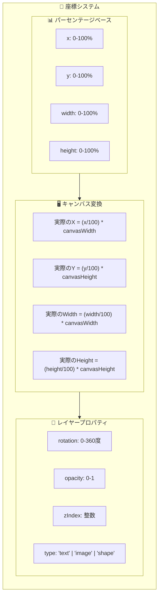
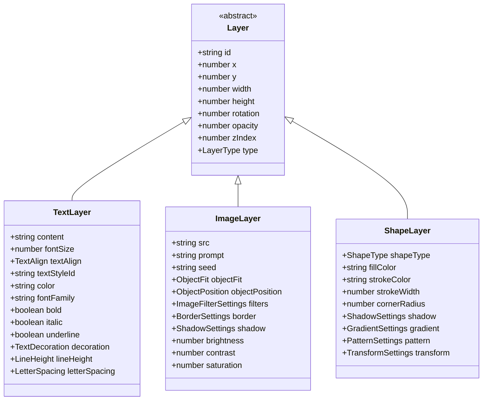
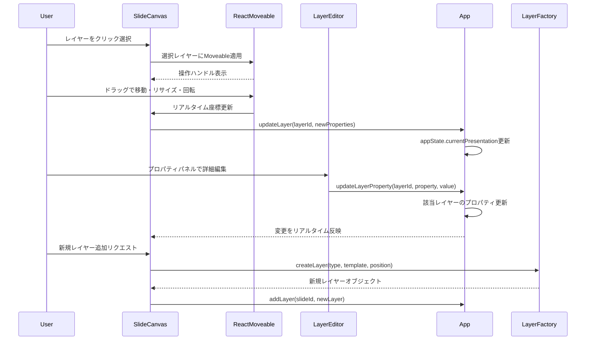
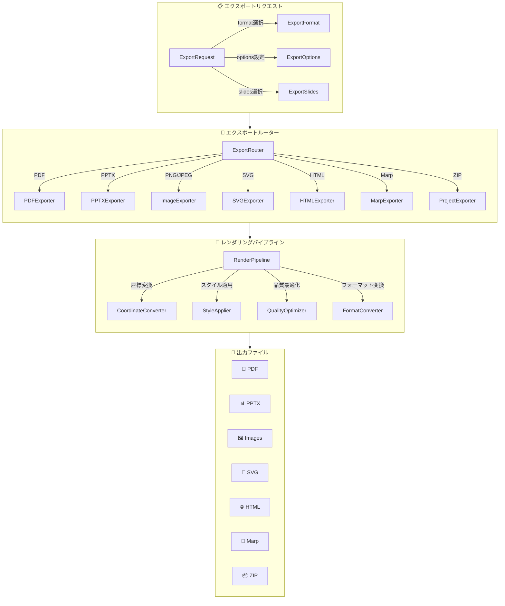
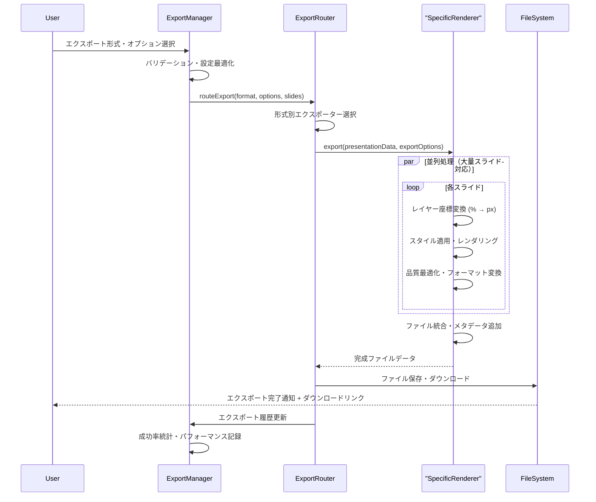
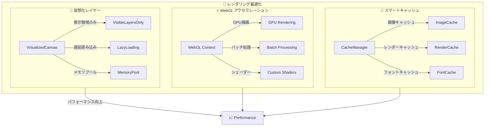

# 3. 詳細設計書 Part 2 - SlideMaster

## 3.4. レイヤーシステム詳細設計

### 3.4.1. パーセンテージベース座標システム

SlideMasterでは、**パーセンテージベース座標システム**を採用し、異なる画面サイズやアスペクト比でも一貫したレイアウトを実現します。



#### 座標システムの特徴

1. **レスポンシブ対応**: すべての座標値が相対値のため、キャンバスサイズに関係なく一貫した配置
2. **アスペクト比独立**: 16:9、4:3、1:1、9:16、3:4の全アスペクト比で適切にレンダリング
3. **精密配置**: 小数点第2位まで対応し、ピクセル単位の精密な配置を実現
4. **エクスポート互換**: PDF、PPTX、画像エクスポート時も座標系を維持

### 3.4.2. レイヤータイプ別詳細仕様



#### テキストレイヤー (TextLayer)

**高度なテキスト処理機能:**
- **21種類のテキストスタイル**: modern-bold-white, elegant-serif-black, creative-script-color等
- **Markdown記法対応**: # ## ### 見出し、**太字**、*斜体*、`コード`をサポート  
- **多言語対応**: 日本語、英語、中国語、韓国語の文字組版に最適化
- **リアルタイム編集**: インライン編集とプロパティパネル編集の両対応

**テキストレンダリング処理:**
```typescript
// markdownRenderer.tsx での実装概念
interface TextRenderingProcess {
  1. Markdown解析: parseMarkdownContent(content)
  2. スタイル適用: applyTextStyle(textStyleId, theme)
  3. レスポンシブ調整: calculateFontSize(fontSize, canvasSize)
  4. 行間・文字間調整: applyTypography(lineHeight, letterSpacing)
  5. 座標変換: convertToPixelCoordinates(x, y, width, height)
}
```

#### 画像レイヤー (ImageLayer)  

**AI画像生成統合:**
- **Imagen-4/3対応**: Google の最新画像生成モデル統合
- **DALL-E統合**: OpenAI の高品質画像生成
- **Fooocus統合**: Stable Diffusion XL カスタマイズ版
- **一貫性制御**: 同一プレゼンテーション内での画像スタイル統一

**画像処理パイプライン:**
```typescript
interface ImageProcessingPipeline {
  1. AI生成: generateImage(prompt, provider, settings)
  2. 品質最適化: optimizeImageQuality(imageData, targetSize)
  3. フォーマット変換: convertToOptimalFormat(webp, png, jpg)
  4. キャッシュ管理: cacheOptimizedImage(id, imageData)
  5. レンダリング: renderWithObjectFit(objectFit, objectPosition)
}
```

#### シェイプレイヤー (ShapeLayer)

**豊富なシェイプタイプ:**
- **基本図形**: rectangle, circle, triangle, polygon
- **矢印・線**: arrow, line, curved-line, connector
- **アイコン**: star, heart, diamond, hexagon
- **カスタムパス**: SVGパス記法による自由図形

### 3.4.3. レイヤー操作システム



#### 直感的操作の実現

1. **react-moveable統合**: ドラッグ&ドロップ、リサイズ、回転を直感的に操作
2. **スナップ機能**: グリッド、他レイヤー、ガイドラインへの自動スナップ
3. **複数選択**: Shift+クリックやドラッグ選択による一括操作
4. **コピー&ペースト**: Ctrl+C/V による効率的な複製
5. **レイヤー順序**: ドラッグ&ドロップによるzIndex調整

## 3.5. エクスポートシステム詳細設計

### 3.5.1. 9形式対応マルチエクスポートアーキテクチャ



### 3.5.2. エクスポート形式別仕様

#### PDF エクスポート (jsPDF)
```typescript
interface PDFExportSpecs {
  ライブラリ: "jsPDF 3.0.1";
  解像度: "300dpi (印刷品質) / 150dpi (標準) / 72dpi (Web)";
  サイズ: "A4, A3, Letter, Legal, カスタム";
  品質: "高品質 (ベクター + 高解像度画像)";
  特徴: [
    "ベクターテキスト保持",
    "高解像度画像埋め込み", 
    "レイヤー構造保持",
    "フォント埋め込み対応",
    "透明度・影効果対応"
  ];
}
```

#### PowerPoint エクスポート (PptxGenJS)
```typescript  
interface PPTXExportSpecs {
  ライブラリ: "PptxGenJS 3.12.0";
  互換性: "PowerPoint 2016以降、LibreOffice、Google Slides";
  レイアウト: "16:9, 4:3 完全対応";
  品質: "ネイティブPowerPoint品質";
  特徴: [
    "テキスト編集可能",
    "レイヤー個別操作可能",
    "アニメーション設定保持",
    "スピーカーノート統合",
    "マスタースライド対応"
  ];
}
```

#### 画像エクスポート (html-to-image)
```typescript
interface ImageExportSpecs {
  ライブラリ: "html-to-image 1.11.13";
  形式: "PNG (可逆), JPEG (非可逆), WebP (最適)";
  解像度: "4K (3840x2160), 2K (2560x1440), HD (1920x1080), カスタム";
  品質: "最高 (100%), 高 (90%), 中 (75%), 標準 (60%)";
  特徴: [
    "ピクセルパーフェクト",
    "透明度完全対応",
    "バッチ一括エクスポート",
    "プログレス表示",
    "メモリ最適化"
  ];
}
```

### 3.5.3. エクスポート処理フロー



## 3.6. パフォーマンス最適化詳細設計

### 3.6.1. レンダリング最適化



#### 仮想化システム
1. **表示領域最適化**: 画面外のレイヤーは描画をスキップ
2. **動的ロード**: 必要な時のみリソースを読み込み
3. **メモリプール**: レイヤーオブジェクトの再利用でGC負荷軽減

#### GPU アクセラレーション
1. **WebGL活用**: Canvas 2D APIの代わりにWebGLで高速描画
2. **バッチレンダリング**: 複数レイヤーを一度に処理
3. **カスタムシェーダー**: 特殊効果の GPU 実装

### 3.6.2. メモリ管理システム

```typescript
interface MemoryManagementSystem {
  // 画像メモリ管理
  imageCache: {
    maxSize: "512MB",
    compression: "WebP + Gzip",
    evictionPolicy: "LRU (Least Recently Used)",
    preloading: "次スライドの事前読み込み"
  };
  
  // レイヤーオブジェクトプール
  layerPool: {
    poolSize: "1000 objects",
    reuseStrategy: "Type別プール管理",
    cleanupInterval: "30秒間隔",
    memoryThreshold: "使用量90%でクリーンアップ"
  };
  
  // ガベージコレクション最適化
  gcOptimization: {
    cyclicReferencePrevention: "WeakMap使用",
    eventListenerCleanup: "自動削除機構",
    timerCleanup: "setInterval/setTimeout管理"
  };
}
```

---

**次のセクションは Part 3 に続きます**: `03_Detailed_Design_Part3.md`