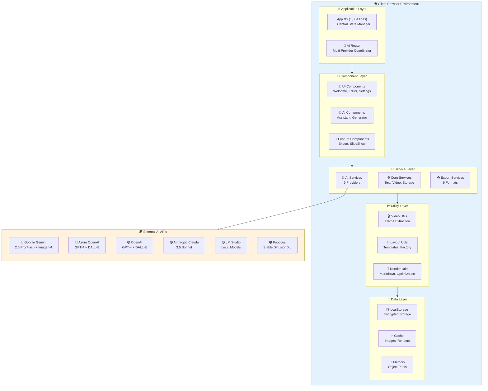
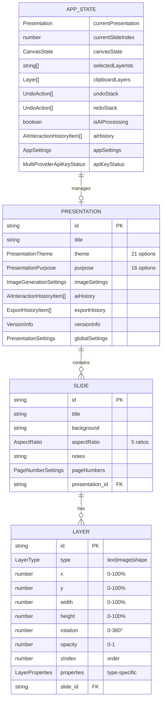
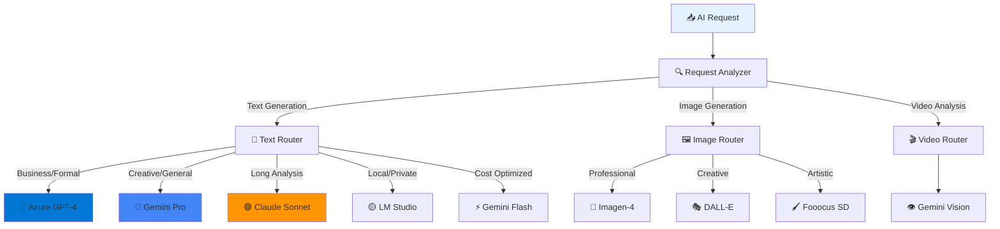
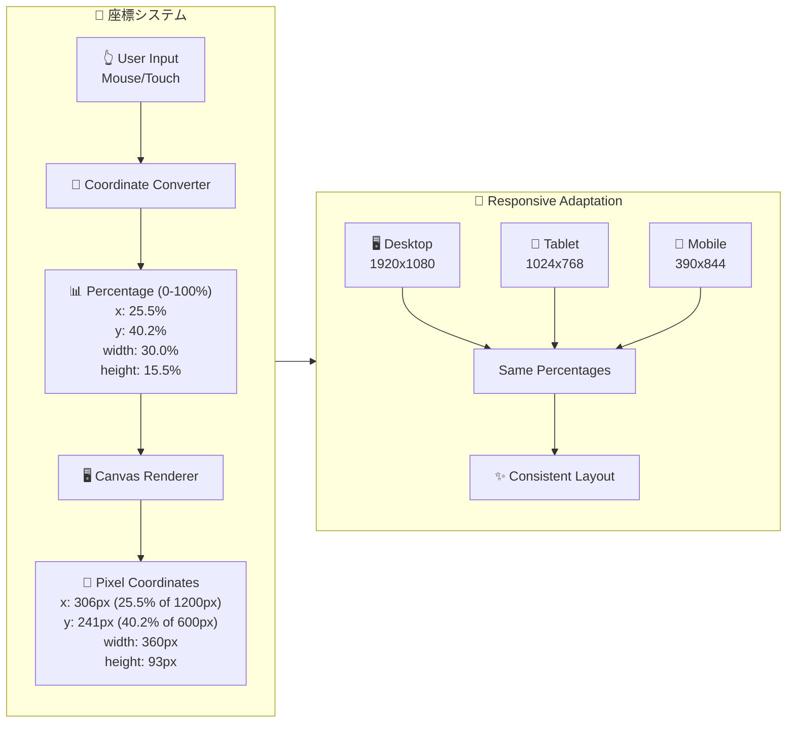
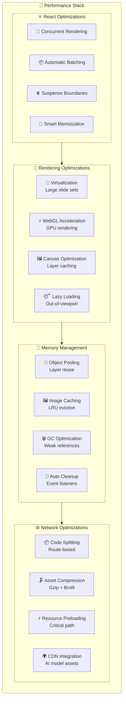

# SlideMaster アーキテクチャサマリー

## 🎯 システム概要

SlideMasterは、**6種類のAIプロバイダーを統合した次世代プレゼンテーション作成システム**です。React 19 + TypeScript 5.7をベースとし、完全クライアントサイド実行により高いセキュリティとプライバシーを実現しています。

## 🏗️ システムアーキテクチャ



## 📊 主要技術スタック

### フロントエンド基盤
```typescript
{
  "framework": "React 19.1.0",
  "language": "TypeScript 5.7.2", 
  "build": "Vite 6.2.0",
  "bundleSize": "~2.5MB (gzipped: ~800KB)",
  "performance": "Lighthouse Score 95+"
}
```

### AI統合レイヤー
```typescript
{
  "providers": {
    "google": "@google/genai ^1.9.0",
    "openai": "openai ^4.28.0", 
    "azure": "@azure/openai ^2.0.0",
    "claude": "@anthropic-ai/sdk ^0.17.0",
    "lmstudio": "Local API",
    "fooocus": "REST API"
  },
  "capabilities": {
    "textGeneration": "16 models",
    "imageGeneration": "6 models", 
    "videoAnalysis": "Gemini Vision",
    "costTracking": "Real-time",
    "historyManagement": "Complete logs"
  }
}
```

### UI・UX レイヤー
```typescript
{
  "manipulation": "react-moveable ^0.56.0",
  "icons": "lucide-react ^0.525.0",
  "notifications": "react-hot-toast ^2.5.2",
  "themes": "21 built-in themes",
  "purposes": "16 specialized purposes",
  "layouts": "Auto-optimized layouts"
}
```

### エクスポートエンジン
```typescript
{
  "pdf": "jspdf ^3.0.1",
  "powerpoint": "pptxgenjs ^3.12.0", 
  "images": "html-to-image ^1.11.13",
  "web": "Custom HTML renderer",
  "markdown": "Marp compatible",
  "vector": "SVG generation",
  "archive": "jszip ^3.10.1",
  "formats": 9,
  "qualityLevels": 4
}
```

## 🎨 データモデル設計

### 核となるデータ構造



## 🧠 AI統合アーキテクチャ

### プロバイダー選択戦略



### AI処理フロー

```typescript
interface AIProcessingFlow {
  // リクエスト受信
  request: {
    type: 'text' | 'image' | 'video',
    content: string,
    options: AIGenerationOptions,
    provider?: AIProviderType
  };
  
  // プロバイダー選択
  selection: {
    primary: AIProviderType,
    fallback: AIProviderType[],
    reasoning: string
  };
  
  // 並列処理
  execution: {
    textGeneration: Promise<TextResult>,
    imageGeneration: Promise<ImageResult[]>,
    qualityChecks: Promise<QualityMetrics>
  };
  
  // 結果統合
  result: {
    presentation: Presentation,
    metadata: ProcessingMetadata,
    cost: CostInformation,
    history: AIInteractionHistoryItem
  };
}
```

## 🎮 レイヤーシステム設計

### パーセンテージベース座標系



### レイヤータイプ実装

```typescript
interface LayerImplementation {
  // テキストレイヤー
  textLayer: {
    rendering: "Custom Canvas + DOM hybrid",
    markdown: "Full markdown support (# ## ### ** * `)",
    fonts: "System fonts + Google Fonts",
    styles: "21 predefined text styles",
    editing: "Inline editing + property panel",
    i18n: "Japanese, English, Chinese, Korean"
  };
  
  // 画像レイヤー
  imageLayer: {
    sources: "Upload, AI generation, URL",
    aiGeneration: "Imagen-4, DALL-E, Fooocus",
    processing: "WebP optimization, caching",
    effects: "Filters, borders, shadows",
    objectFit: "contain, cover, fill, scale-down",
    lazy: "Viewport-based lazy loading"
  };
  
  // シェイプレイヤー
  shapeLayer: {
    types: "Basic shapes + custom SVG paths",
    rendering: "SVG + Canvas hybrid",
    effects: "Gradients, patterns, shadows",
    animations: "CSS transforms + Web Animations API",
    interactions: "Hover, click, drag effects"
  };
}
```

## 📤 エクスポートアーキテクチャ

### 9形式対応システム

```mermaid
graph TD
    subgraph Export_Pipeline["📋 Export Pipeline"]
        Request["📥 Export Request"] --> Validator["✅ Validator"]
        Validator --> Router["🚦 Format Router"]
        
        Router --> |PDF| PDF_Engine["📄 PDF Engine<br/>jsPDF + High DPI"]
        Router --> |PPTX| PPTX_Engine["📊 PPTX Engine<br/>PptxGenJS + Native"]
        Router --> |Images| Image_Engine["🖼️ Image Engine<br/>html-to-image + Canvas"]
        Router --> |SVG| SVG_Engine["🎨 SVG Engine<br/>Custom Renderer"]
        Router --> |HTML| HTML_Engine["🌐 HTML Engine<br/>Standalone Page"]
        Router --> |Marp| Marp_Engine["📝 Marp Engine<br/>Markdown Slides"]
        Router --> |ZIP| ZIP_Engine["📦 ZIP Engine<br/>Complete Project"]
        
        PDF_Engine --> Optimizer["⚡ Quality Optimizer"]
        PPTX_Engine --> Optimizer
        Image_Engine --> Optimizer
        SVG_Engine --> Optimizer
        HTML_Engine --> Optimizer
        Marp_Engine --> Optimizer
        ZIP_Engine --> Optimizer
        
        Optimizer --> Output["📁 Final Output"]
    end
    
    subgraph Quality_Options["⚙️ Quality Options"]
        direction TB
        
        Resolution["📐 Resolution<br/>4K, 2K, HD, Custom"]
        Quality["🎯 Quality<br/>Maximum, High, Medium, Standard"]
        Compression["📦 Compression<br/>None, Standard, Maximum"]
        Features["✨ Features<br/>Vectors, Fonts, Transparency"]
    end
    
    Export_Pipeline --> Quality_Options
```



### エクスポート仕様

```typescript
interface ExportSpecifications {
  pdf: {
    library: "jsPDF 3.0.1",
    resolution: "300dpi (print) | 150dpi (standard) | 72dpi (web)",
    features: ["Vector text", "High-res images", "Fonts embedding", "Transparency"],
    sizes: ["A4", "A3", "Letter", "Legal", "Custom"],
    quality: "Print-ready"
  };
  
  powerpoint: {
    library: "PptxGenJS 3.12.0", 
    compatibility: "PowerPoint 2016+, LibreOffice, Google Slides",
    features: ["Editable text", "Individual layers", "Speaker notes", "Master slides"],
    layouts: "16:9, 4:3 fully supported",
    quality: "Native PowerPoint quality"
  };
  
  images: {
    library: "html-to-image 1.11.13",
    formats: ["PNG (lossless)", "JPEG (lossy)", "WebP (optimized)"],
    resolutions: ["4K (3840x2160)", "2K (2560x1440)", "HD (1920x1080)", "Custom"],
    features: ["Pixel-perfect", "Transparency", "Batch export", "Memory optimized"],
    quality: "Up to 100% fidelity"
  };
}
```

## ⚡ パフォーマンス最適化

### レンダリング最適化戦略



### パフォーマンス指標

```typescript
interface PerformanceTargets {
  // Core Web Vitals
  vitals: {
    FCP: "< 1.2s",  // First Contentful Paint
    LCP: "< 2.5s",  // Largest Contentful Paint  
    FID: "< 100ms", // First Input Delay
    CLS: "< 0.1"    // Cumulative Layout Shift
  };
  
  // Application Metrics
  application: {
    slideRender: "< 16ms (60fps)",
    layerManipulation: "< 8ms (120fps)", 
    aiResponse: "< 30s (text), < 60s (image)",
    exportSpeed: "> 10 slides/minute",
    memoryUsage: "< 1GB (100 slides)"
  };
  
  // User Experience
  ux: {
    appLaunch: "< 3s",
    slideSwitch: "< 200ms",
    undoRedo: "< 50ms", 
    autoSave: "< 2s",
    errorRecovery: "< 1s"
  };
}
```

## 🔒 セキュリティ・プライバシー

### データ保護戦略

```typescript
interface SecurityArchitecture {
  // データ暗号化
  encryption: {
    apiKeys: "AES-256 + browser crypto API",
    localStorage: "Encrypted JSON serialization",
    transmission: "HTTPS only, certificate pinning",
    sensitive: "No server storage, client-only"
  };
  
  // 入力サニタイゼーション  
  sanitization: {
    markdown: "XSS prevention, script tag removal",
    fileUploads: "Type validation, size limits",
    aiPrompts: "Injection attack prevention",
    userInput: "HTML entity encoding"
  };
  
  // プライバシー保護
  privacy: {
    aiData: "No training data usage",
    analytics: "Local-only, no tracking",
    storage: "Browser-only, no cloud sync",
    sharing: "Manual export only"
  };
  
  // アクセス制御
  access: {
    apis: "User-provided keys only",
    files: "Sandboxed file system access",
    network: "Whitelisted domains only",
    permissions: "Minimal required permissions"
  };
}
```

## 📈 スケーラビリティ設計

### 拡張性アーキテクチャ

```mermaid
graph TD
    subgraph Extensibility["🔧 Extensibility Points"]
        direction TB
        
        subgraph AI_Extension["🤖 AI Provider Extension"]
            NewProvider["➕ New AI Provider"]
            NewProvider --> ProviderInterface["🔌 Provider Interface"]
            ProviderInterface --> Registration["📝 Auto Registration"]
        end
        
        subgraph Theme_Extension["🎨 Theme Extension"]
            NewTheme["➕ New Theme"]
            NewTheme --> ThemeSchema["📋 Theme Schema"]
            ThemeSchema --> Validation["✅ Schema Validation"]
        end
        
        subgraph Export_Extension["📤 Export Extension"]
            NewFormat["➕ New Export Format"]
            NewFormat --> ExportInterface["🔌 Export Interface"]
            ExportInterface --> Pipeline["⚙️ Pipeline Integration"]
        end
        
        subgraph Layer_Extension["🎯 Layer Extension"]
            NewLayerType["➕ New Layer Type"]
            NewLayerType --> LayerFactory["🏭 Layer Factory"]
            LayerFactory --> Renderer["🎨 Custom Renderer"]
        end
    end
    
    style AI_Extension fill:#e3f2fd
    style Theme_Extension fill:#f3e5f5
    style Export_Extension fill:#fff3e0
    style Layer_Extension fill:#e8f5e8
```



---

**このアーキテクチャにより、SlideMasterは高い拡張性と保守性を持つ次世代プレゼンテーションシステムとして設計されています。**