# 2. 基本設計書 - SlideMaster

## 2.1. 概要

本ドキュメントは、SlideMasterアプリケーションの基本設計について記述するものです。要件定義書に基づき、**マルチAI統合アーキテクチャ**、**サービス層分離設計**、**拡張されたデータモデル**、および **パフォーマンス最適化設計** を中心としたシステム全体の基本設計を定義します。

### 2.1.1. 設計の特徴

- **マルチAIプロバイダー統合**: 6種類のAIプロバイダー（Gemini、Azure、OpenAI、Claude、LM Studio、Fooocus）の統一インターフェース
- **完全クライアントサイド**: サーバー不要の高セキュリティ・高プライバシー設計
- **モジュラーアーキテクチャ**: サービス層分離による保守性・拡張性の確保
- **高性能レンダリング**: React 19 + WebGL + 仮想化による大規模データ対応
- **包括的エクスポート**: 9形式対応の高品質エクスポートシステム

## 2.2. システムアーキテクチャ

SlideMasterは、**マルチAIプロバイダー統合**を核とした、完全クライアントサイドのシングルページアプリケーション（SPA）として構築されます。

### 2.2.1. 全体アーキテクチャ

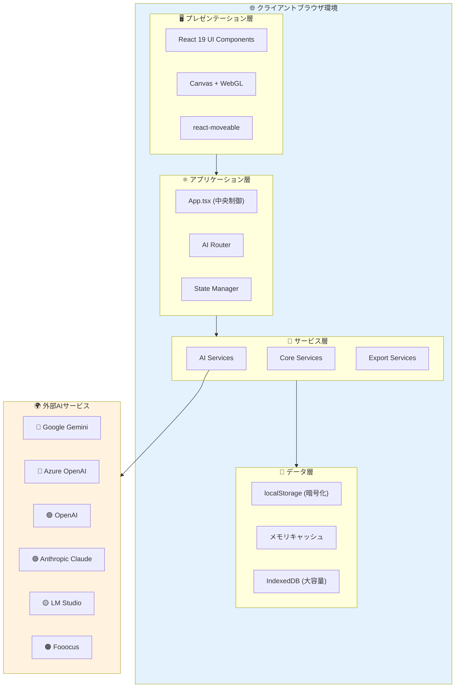

### 2.2.2. 技術スタック

**フロントエンド基盤:**
- **React 19**: 最新のConcurrent Renderingと強化されたHooks
- **TypeScript 5.7**: 高度な型システムによる開発効率向上
- **Vite 6.2**: 高速ビルドシステムとHMR対応

**状態管理:**
- **App.tsx中央集約**: 1,334行の包括的状態管理
- **React Hooks**: useState、useCallback、useMemo最適化
- **コンテキストAPI**: テーマとプロバイダー情報の共有

**データ永続化:**
- **localStorage**: 設定とAPIキー（暗号化保存）
- **IndexedDB**: 大容量画像とプレゼンテーションデータ
- **メモリキャッシュ**: レンダリング最適化用一時データ

**AI統合:**
- **統一インターフェース**: 6プロバイダー対応のAIRouter
- **並列処理**: Promise.allによる高速レスポンス
- **フォールバック**: エラー時の自動プロバイダー切り替え

## 2.3. モジュラーコンポーネント設計

### 2.3.1. 階層化コンポーネント構成

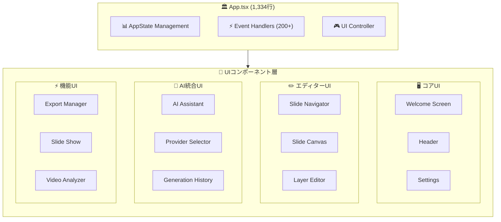

### 2.3.2. コンポーネント責務定義

| コンポーネント名 | 責務 | 実装規模 |
| :--- | :--- | :--- |
| **App.tsx** | **中央制御システム**: 全状態管理、AIプロバイダー制御、200+イベントハンドラー | 1,334行 |
| **WelcomeScreen.tsx** | **エントリーポイント**: 新規作成、プロジェクト読込、AI生成、動画分析起動 | 中規模 |
| **Header.tsx** | **グローバル操作**: 保存、エクスポート、設定、AIアシスタント、プロバイダー切替 | 小規模 |
| **SlideNavigator.tsx** | **スライド管理**: 一覧表示、追加・削除・複製・順序変更、サムネイル生成 | 中規模 |
| **SlideCanvas.tsx** | **レイヤー操作**: react-moveable統合、ドラッグ&ドロップ、選択管理 | 大規模 |
| **LayerEditor.tsx** | **プロパティ編集**: レイヤータイプ別詳細設定、リアルタイム反映 | 大規模 |
| **AIAssistant.tsx** | **AI統合**: マルチプロバイダー制御、生成履歴、コスト追跡 | 大規模 |
| **ExportManager.tsx** | **エクスポート制御**: 9形式対応、品質設定、バッチ処理 | 中規模 |
| **SlideShow.tsx** | **プレゼンテーション再生**: フルスクリーン、キーボード操作、ナビゲーション | 中規模 |
| **VideoAnalyzer.tsx** | **動画分析**: フレーム抽出、AI分析、マニュアル生成ワークフロー | 中規模 |
| **Settings.tsx** | **環境設定**: APIキー管理、テーマ設定、プロバイダー優先度設定 | 中規模 |

### 2.3.3. サブコンポーネント構成

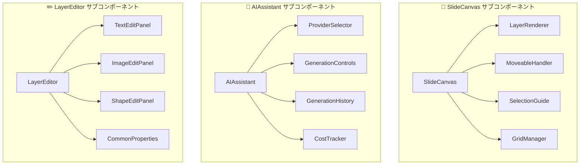

## 2.4. 画面遷移設計

### 2.4.1. メイン画面遷移

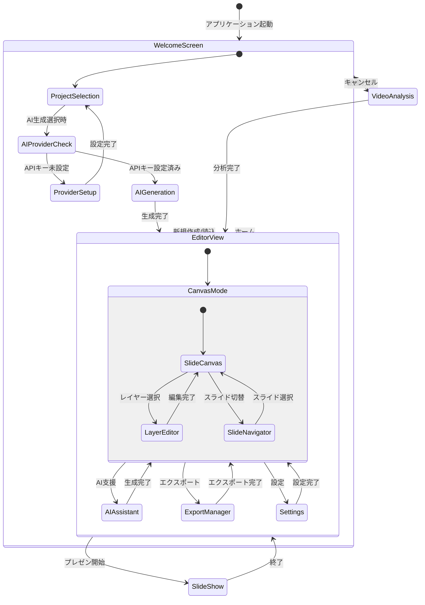

### 2.4.2. モーダル管理設計

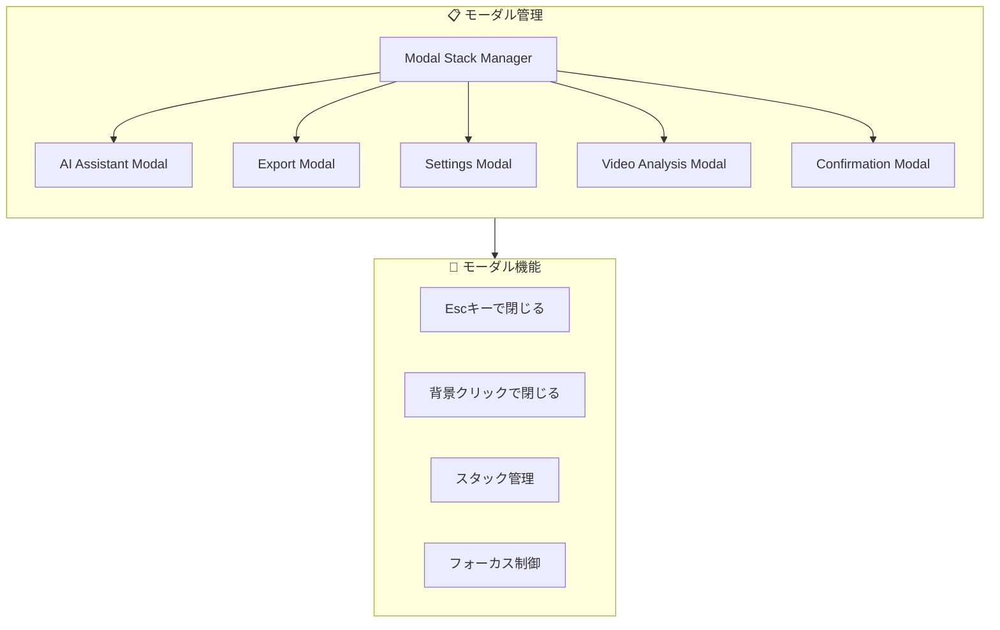

## 2.5. 拡張されたデータモデル設計

### 2.5.1. 包括的ER図

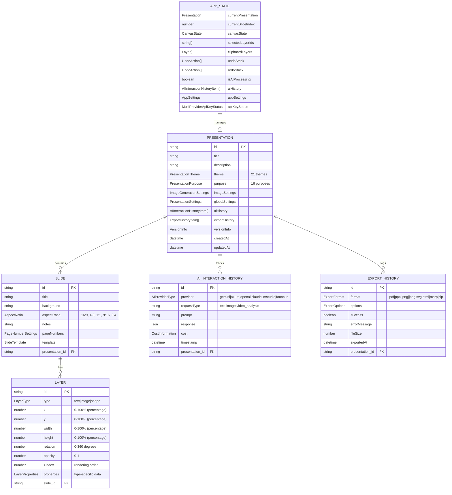

### 2.5.2. データ型詳細定義

#### PresentationTheme (21種類)
```typescript
type PresentationTheme = 
  | 'modern-dark' | 'modern-light' | 'modern-blue' 
  | 'elegant-white' | 'elegant-cream' | 'elegant-gray'
  | 'creative-vibrant' | 'creative-pastel' | 'creative-neon'
  | 'business-formal' | 'business-clean' | 'business-corporate'
  | 'academic-simple' | 'academic-classic' | 'academic-scientific'
  | 'storytelling-warm' | 'storytelling-adventure' | 'storytelling-fairytale'
  | 'tech-minimal' | 'tech-cyber' | 'tech-retro';
```

#### PresentationPurpose (16種類)
```typescript
type PresentationPurpose =
  | 'business-proposal' | 'business-report' | 'business-strategy'
  | 'education-lecture' | 'education-training' | 'education-workshop'
  | 'storytelling-narrative' | 'storytelling-case-study'
  | 'tech-documentation' | 'tech-api-guide' | 'tech-architecture'
  | 'marketing-pitch' | 'marketing-campaign'
  | 'research-findings' | 'research-methodology'
  | 'personal-portfolio';
```

#### AIProviderType (6種類)
```typescript
type AIProviderType = 
  | 'gemini'    // Google Gemini Pro/Flash + Imagen
  | 'azure'     // Azure OpenAI GPT-4 + DALL-E
  | 'openai'    // OpenAI GPT-4 + DALL-E
  | 'claude'    // Anthropic Claude 3.5 Sonnet
  | 'lmstudio'  // Local LM Studio
  | 'fooocus';  // Fooocus (Stable Diffusion XL)
```

## 2.6. マルチAIプロバイダー連携

### 2.6.1. AIプロバイダー統合アーキテクチャ

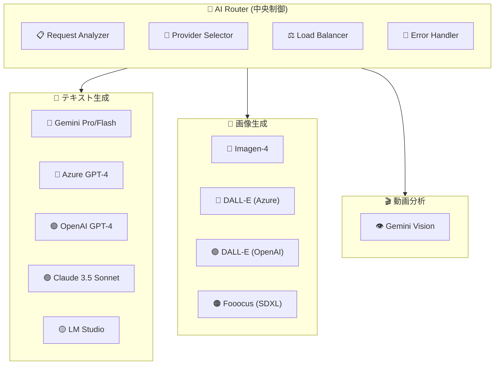

### 2.6.2. プロバイダー別仕様

#### Google Gemini
```typescript
interface GeminiIntegration {
  library: "@google/genai ^1.9.0";
  models: {
    text: ["gemini-2.5-pro", "gemini-2.5-flash"];
    image: ["imagen-4", "imagen-3"];
    vision: ["gemini-2.5-pro-vision"];
  };
  features: [
    "高速テキスト生成",
    "多言語対応",
    "長文解析",
    "動画フレーム分析",
    "コスト最適化"
  ];
}
```

#### Azure OpenAI
```typescript
interface AzureOpenAIIntegration {
  library: "@azure/openai ^2.0.0";
  models: {
    text: ["gpt-4", "gpt-4-turbo"];
    image: ["dall-e-3"];
  };
  features: [
    "エンタープライズ対応",
    "高品質テキスト",
    "プロフェッショナル画像",
    "セキュリティ強化"
  ];
}
```

#### OpenAI
```typescript
interface OpenAIIntegration {
  library: "openai ^4.28.0";
  models: {
    text: ["gpt-4", "gpt-4-turbo"];
    image: ["dall-e-3"];
  };
  features: [
    "最新モデル対応",
    "高品質出力",
    "創造的生成"
  ];
}
```

#### Anthropic Claude
```typescript
interface ClaudeIntegration {
  library: "@anthropic-ai/sdk ^0.17.0";
  models: {
    text: ["claude-3.5-sonnet"];
  };
  features: [
    "長文処理",
    "論理的思考",
    "詳細分析",
    "安全性重視"
  ];
}
```

#### LM Studio (ローカル)
```typescript
interface LMStudioIntegration {
  connection: "Local REST API";
  models: "User-configured local models";
  features: [
    "プライバシー保護",
    "オフライン動作",
    "カスタムモデル",
    "コスト削減"
  ];
}
```

#### Fooocus
```typescript
interface FooucusIntegration {
  connection: "REST API";
  models: ["Stable Diffusion XL Custom"];
  features: [
    "アーティスティック画像",
    "高度なカスタマイズ",
    "スタイル制御",
    "品質最適化"
  ];
}
```

### 2.6.3. プロバイダー選択戦略

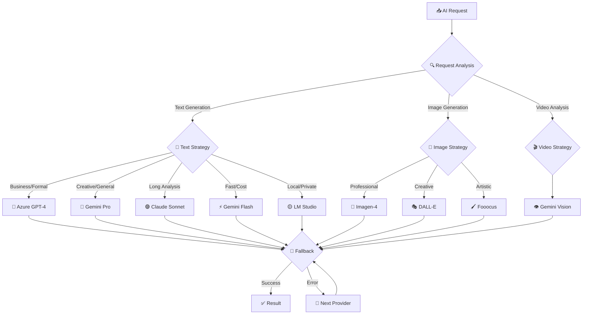

## 2.7. サービス層分離設計

### 2.7.1. サービスアーキテクチャ

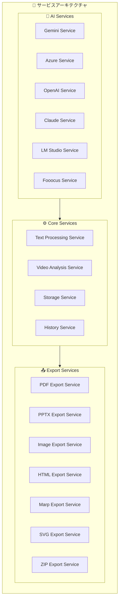

### 2.7.2. サービス別責務

#### AI Services
- **統一インターフェース**: 各AIプロバイダーの抽象化
- **ロードバランシング**: リクエストの最適分散
- **エラーハンドリング**: フォールバックとリトライ
- **コスト管理**: 使用量と料金の追跡

#### Core Services
- **テキスト処理**: Markdownレンダリング、スタイル適用
- **動画分析**: フレーム抽出、AI分析統合
- **ストレージ**: データ永続化、キャッシュ管理
- **履歴管理**: AIインタラクション、エクスポート履歴

#### Export Services
- **フォーマット変換**: 各形式への最適化変換
- **品質制御**: 解像度、圧縮率の調整
- **バッチ処理**: 大量スライドの効率処理
- **メタデータ管理**: 作者情報、作成日時の埋め込み

## 2.8. パフォーマンス最適化設計

### 2.8.1. レンダリング最適化戦略

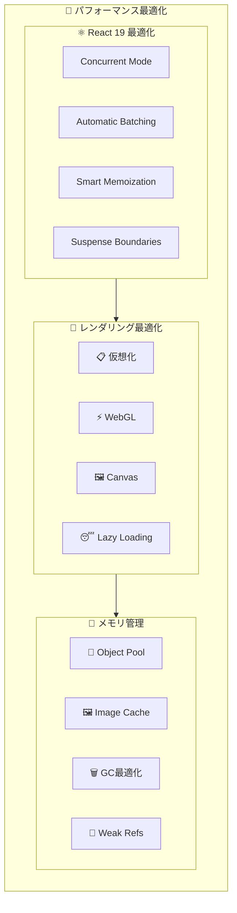

### 2.8.2. パフォーマンス目標値

```typescript
interface PerformanceTargets {
  // Core Web Vitals
  coreWebVitals: {
    FCP: "< 1.2s";      // First Contentful Paint
    LCP: "< 2.5s";      // Largest Contentful Paint
    FID: "< 100ms";     // First Input Delay
    CLS: "< 0.1";       // Cumulative Layout Shift
  };
  
  // アプリケーション指標
  application: {
    slideRendering: "< 16ms (60fps)";
    layerManipulation: "< 8ms (120fps)";
    aiResponseTime: "< 30s (text), < 60s (image)";
    exportSpeed: "> 10 slides/minute";
    memoryUsage: "< 1GB (100 slides)";
  };
  
  // ユーザーエクスペリエンス
  userExperience: {
    appLaunch: "< 3s";
    slideSwitch: "< 200ms";
    undoRedo: "< 50ms";
    autoSave: "< 2s";
    errorRecovery: "< 1s";
  };
}
```

### 2.8.3. メモリ管理システム

- **仮想化レンダリング**: 大量スライドでも高速表示
- **WebGLアクセラレーション**: GPUを活用した高速描画
- **オブジェクトプール**: レイヤーオブジェクトの再利用
- **イメージキャッシュ**: LRUアルゴリズムによる効率管理
- **ガベージコレクション最適化**: メモリリーク防止

### 2.8.4. ネットワーク最適化

- **並列AIリクエスト**: Promise.allによる高速処理
- **リトライ機構**: 指数バックオフで失敗耐性向上
- **キャッシュ管理**: AIレスポンスのスマートキャッシュ
- **プリロード**: 次のスライドの事前読み込み

## 2.9. セキュリティ設計

### 2.9.1. データ保護戦略

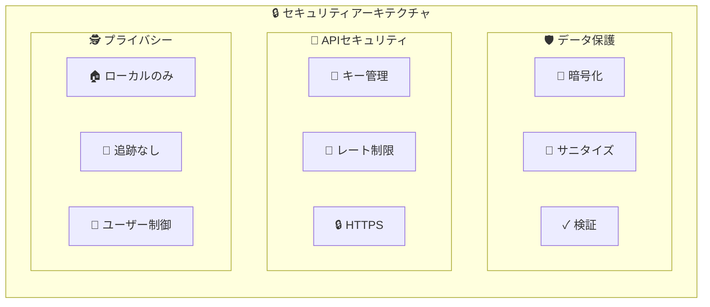

### 2.9.2. セキュリティ機能

#### データ暗号化
- **APIキー**: ブラウザ暗号化APIでローカル暗号化
- **センシティブデータ**: メモリ上のみで処理
- **通信**: HTTPSのみ、証明書ピンニング

#### 入力サニタイゼーション
- **XSS対策**: HTMLエンティティエンコーディング
- **Markdown**: 危険なスクリプトタグの除去
- **ファイルアップロード**: タイプ検証、サイズ制限

#### プライバシー保護
- **データ居住地**: ブラウザローカルのみ
- **アナリティクス**: ローカルのみ、外部送信なし
- **AIデータ**: トレーニングデータ使用なし

---

**この基本設計書により、SlideMasterの包括的なシステム設計を把握できます。**
