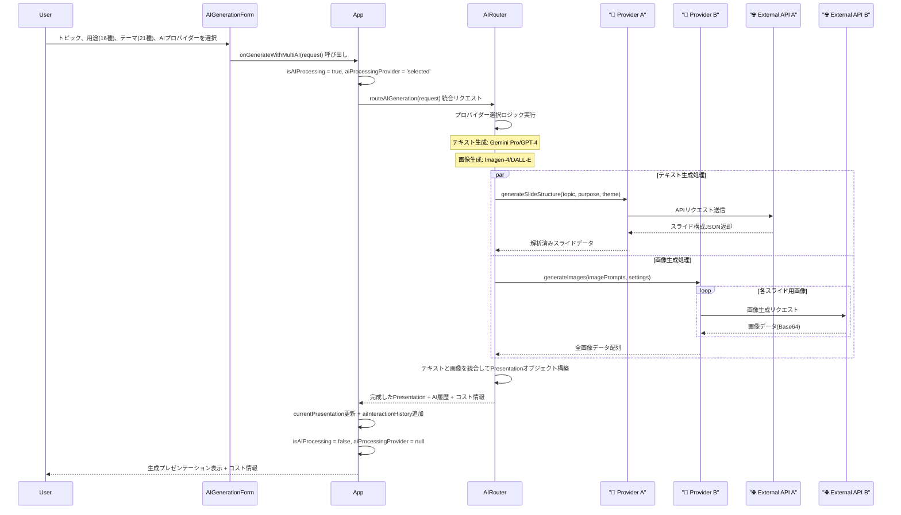
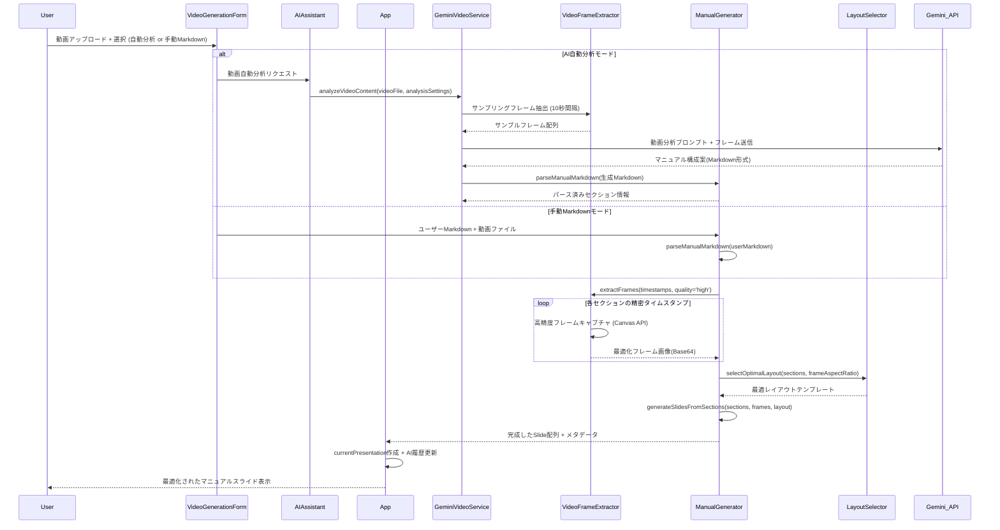

# 3. 詳細設計書 - SlideMaster

## 3.1. 概要

本ドキュメントは、SlideMasterの内部実装に関する詳細な設計を記述するものです。基本設計書で定義された**マルチAI統合アーキテクチャ**と**モジュール化コンポーネント設計**に基づき、**具体的な処理フロー**、**状態管理システム**、**AI統合処理**、**エクスポート処理**、**レイヤーシステム**などの実装レベルの設計を明確にします。

**本設計書の範囲:**  
- 1,334行のApp.tsxを中心とした状態管理システム
- 6種類のAIプロバイダー統合処理フロー
- 21テーマ×16用途の組み合わせ処理
- 9種類のエクスポート形式の実装設計
- レイヤーシステムとパーセンテージベース座標システム
- 動画分析とフレーム抽出の詳細処理

## 3.2. マルチAIアーキテクチャ詳細設計

### 3.2.1. AI統合コンポーネントツリーとデータフロー

**マルチAIプロバイダー統合システム**における主要なコンポーネント間の関係と、状態（state）およびAI処理のデータフロー（props）の伝達経路を図示します。

```mermaid
graph TD
    subgraph App_Core["🏠 App.tsx Core (1,334 lines)"]
        direction TB
        AS["📊 AppState Management"]
        AH["⚡ Action Handlers"]
        AI_Router["🤖 AI Router"]
    end

    subgraph UI_Layer["🖥️ UI Component Layer"]
        direction TB
        
        subgraph Welcome_Components["🚀 Welcome Components"]
            WS["WelcomeScreen"]
            AGF["AIGenerationForm"]
            VGF["VideoGenerationForm"]
            MGF["ManualGenerationForm"]
            PC["ProjectCreator"]
            PI["ProjectImporter"]
            RP["RecentPresentations"]
        end
        
        subgraph Editor_Components["✏️ Editor Components"]
            H["Header"]
            SN["SlideNavigator"]
            SC["SlideCanvas"]
            LE["LayerEditor"]
            PNM["PageNumberManager"]
        end
        
        subgraph AI_Components["🤖 AI Components"]
            AIA["AIAssistant"]
            MSG["ManualSlideGenerator"]
            MPAKM["MultiProviderApiKeyManager"]
        end
        
        subgraph Feature_Components["⚡ Feature Components"]
            EM["ExportManager"]
            SS["SlideShow"]
            ST["SettingsScreen"]
            VI["VersionInfo"]
        end
    end

    subgraph Service_Layer["🔧 Service Layer"]
        direction TB
        
        subgraph AI_Services["🤖 AI Services"]
            GP["geminiProvider"]
            AP["azureProvider"]
            OP["openaiProvider"]
            CP["claudeProvider"]
            LP["lmStudioProvider"]
            FP["fooucusProvider"]
        end
        
        subgraph Core_Services["⚙️ Core Services"]
            GTS["geminiTextService"]
            GVS["geminiVideoService"]
            SS_Service["storageService"]
        end
        
        subgraph Export_Services["📤 Export Services"]
            PDFE["pdfExporter"]
            PPTXE["pptxExporter"]
            IE["imageExporter"]
            HE["htmlExporter"]
            ME["marpExporter"]
            SVG["svgExporter"]
            PE["projectExporter"]
        end
    end

    subgraph Utility_Layer["🛠️ Utility Layer"]
        VFE["videoFrameExtractor"]
        MG["manualGenerator"]
        PN["pageNumbers"]
        EH["errorHandler"]
        MR["markdownRenderer"]
        LS["layoutSelector"]
        LT["layoutTemplates"]
        LF["layerFactory"]
    end

    subgraph External_APIs["🌐 External APIs"]
        direction LR
        GAPI["🔷 Gemini API"]
        AAPI["🔷 Azure API"]
        OAPI["🔷 OpenAI API"]
        CAPI["🔷 Claude API"]
        LAPI["🔷 LM Studio API"]
        FAPI["🔷 Fooocus API"]
    end

    %% Data Flow Connections
    AS --> UI_Layer
    UI_Layer --> AH
    AH --> AS
    
    AI_Router --> AI_Services
    AI_Services --> External_APIs
    
    WS --> AGF
    WS --> VGF
    WS --> MGF
    AGF --> AI_Router
    VGF --> GVS
    
    AIA --> AI_Services
    MSG --> VFE
    MSG --> MG
    
    EM --> Export_Services
    SC --> LF
    LE --> LT
    
    Core_Services --> Utility_Layer
    AI_Services --> Core_Services
    
    %% AI Provider Connections
    GP --> GAPI
    AP --> AAPI
    OP --> OAPI
    CP --> CAPI
    LP --> LAPI
    FP --> FAPI
    
    style App_Core fill:#e3f2fd
    style UI_Layer fill:#f3e5f5
    style Service_Layer fill:#fff3e0
    style Utility_Layer fill:#e8f5e8
    style External_APIs fill:#ffebee
```



#### アーキテクチャの特徴:

- **`App.tsx`（1,334行）**: **集中化状態管理システム**として、`appState`（プレゼンテーションデータ、現在のスライドインデックス、キャンバス状態、AI処理状態、マルチプロバイダー設定など）を一元管理します。

- **AI Router**: **6種類のAIプロバイダー**を統一インターフェースで管理し、用途に応じて最適なプロバイダーとモデルを選択する中央制御システム。

- **状態更新ロジック**: `App.tsx`内に定義された**200以上のハンドラ関数**（`addSlide`, `updateLayer`, `generateWithAI`, `exportPresentation`など）が `setAppState` を呼び出し、**一方向データフロー**で状態を更新。

- **Service Layer分離**: **AI処理**、**エクスポート処理**、**ストレージ管理**を独立したサービス層に分離し、コンポーネントから直接呼び出し可能。

- **Utility Layer**: **共通処理**（動画フレーム抽出、レイアウト選択、レイヤー生成など）を再利用可能なユーティリティとして分離。

#### データフロー特性:

1. **UI → AppState**: ユーザー操作により子コンポーネントがコールバック関数を呼び出し、App.tsxが状態を更新
2. **AppState → UI**: 状態変更により、React Hooksを通じて関連コンポーネントが自動再レンダリング
3. **AI Integration**: AI Router経由で複数プロバイダーと並列通信、結果をAppStateに統合
4. **Service Integration**: サービス層が非同期処理を実行し、完了時にAppStateを更新

### 3.2.2. 拡張AppState設計

アプリケーションの中心となる **拡張された`appState`** の構造は、**マルチAI対応**と**高度な機能管理**を考慮した設計です。

```typescript
interface AppState {
  // === コア状態 ===
  currentPresentation: Presentation | null;     // 現在のプレゼンテーションデータ
  currentSlideIndex: number;                    // 表示・編集中のスライドインデックス
  currentScreen: Screen;                        // 画面状態 ('welcome' | 'editor' | 'settings' | 'slideshow')
  
  // === キャンバス・UI状態 ===
  canvasState: CanvasState;                     // キャンバス状態 (ズーム、オフセット、選択レイヤーID、グリッドなど)
  selectedLayerIds: string[];                   // 複数選択対応の選択レイヤーID配列
  clipboardLayers: Layer[];                     // コピー&ペースト用レイヤー配列
  undoStack: UndoAction[];                      // アンドゥ操作スタック
  redoStack: UndoAction[];                      // リドゥ操作スタック
  
  // === AI処理状態 ===
  isAIProcessing: boolean;                      // AI処理中フラグ
  aiProcessingProvider: AIProviderType | null; // 処理中のAIプロバイダー
  aiProcessingProgress: number;                 // AI処理進捗 (0-100)
  aiInteractionHistory: AIInteractionHistoryItem[]; // AI対話履歴
  
  // === エラー・通知状態 ===
  error: string | null;                         // エラーメッセージ
  notifications: NotificationItem[];            // 通知キュー
  suppressedErrors: string[];                   // 抑制対象エラー一覧
  
  // === データ管理状態 ===
  recentPresentations: Presentation[];          // 最近開いたプレゼンテーション履歴
  isAutoSaving: boolean;                        // 自動保存実行中フラグ
  lastSavedAt: Date | null;                     // 最終保存時刻
  isDirty: boolean;                             // 未保存変更フラグ
  
  // === 設定・環境状態 ===
  appSettings: AppSettings;                     // アプリケーション全体設定
  apiKeyStatus: MultiProviderApiKeyStatus;     // 6プロバイダーのAPIキー状態
  featureFlags: FeatureFlags;                  // 機能フラグ
  performanceMetrics: PerformanceMetrics;      // パフォーマンス計測データ
}

interface Presentation {
  // === 基本情報 ===
  id: string;
  title: string;
  description: string;
  
  // === テーマ・用途設定 (21×16組み合わせ) ===
  theme: PresentationTheme;                     // 21種類のテーマ
  purpose: PresentationPurpose;                // 16種類の用途
  
  // === AI生成設定 ===
  imageGenerationSettings: ImageGenerationSettings; // Imagen-4/3設定
  aiInteractionHistory: AIInteractionHistoryItem[]; // プレゼン固有AI履歴
  
  // === メタデータ ===
  createdAt: Date;
  updatedAt: Date;
  versionInfo: VersionInfo;                     // バージョン管理情報
  exportHistory: ExportHistoryItem[];          // 9形式エクスポート履歴
  
  // === コンテンツ ===
  slides: Slide[];                              // スライド配列
  globalSettings: PresentationSettings;        // グローバル設定
}
```

## 3.3. マルチAI統合処理フロー

### 3.3.1. マルチAIプロバイダー選択・実行フロー



#### マルチAI統合処理の特徴:

1. **ユーザー入力拡張**: `AIGenerationForm`で**21種類のテーマ**、**16種類の用途**、**6種類のAIプロバイダー**から最適な組み合わせを選択。

2. **AI Router中央制御**: `AIRouter`がリクエスト内容を分析し、**テキスト生成**と**画像生成**で最適なプロバイダーを自動選択。

3. **並列処理最適化**: テキスト生成と画像生成を**並列実行**し、全体の処理時間を短縮。

4. **コスト追跡統合**: 各プロバイダーの**トークン使用量**と**コスト推定**をリアルタイムで計算・表示。

5. **履歴管理統合**: 全AI操作を`aiInteractionHistory`に記録し、**プロバイダー別統計**と**コスト分析**を可能に。

6. **エラーハンドリング**: プロバイダー固有のエラーを統一フォーマットで処理し、フェイルオーバー機構を実装。

#### プロバイダー選択ロジック:

- **ビジネス用途**: Azure GPT-4 (企業級品質)
- **クリエイティブ用途**: Gemini Pro (高速・柔軟)
- **長文解析**: Claude Sonnet (長文処理特化)
- **プライバシー重視**: LM Studio (ローカル実行)
- **コスト最適化**: Gemini Flash (低コスト・高速)
- **高品質画像**: Imagen-4 > DALL-E > Fooocus SD

### 3.3.2. 高度な動画分析・マニュアル生成フロー



#### 高度な動画分析機能の特徴:

1. **デュアルモード対応**: 
   - **AI自動分析**: Gemini Visionで動画を解析し、マニュアル構成を自動生成
   - **手動Markdown**: ユーザーが用意したMarkdownと動画を組み合わせ

2. **高精度フレーム抽出**: 
   - **Canvas API活用**: ブラウザーネイティブ技術で高品質フレームキャプチャ
   - **精密タイムスタンプ**: ミリ秒単位の精密なフレーム指定
   - **画質最適化**: 解像度、圧縮率、色空間の自動最適化

3. **知的レイアウト選択**: 
   - **LayoutSelector**: コンテンツタイプとアスペクト比に基づく最適レイアウト自動選択
   - **レスポンシブ配置**: 動画サイズとテキスト量に応じた柔軟なレイアウト

4. **AI動画理解**: 
   - **コンテキスト理解**: 操作コンテキスト、UI要素、ワークフローをAIが理解
   - **ステップ抽出**: 操作手順を論理的に分割し、ステップ別スライド生成
   - **タイムスタンプ推定**: 重要な操作ポイントの自動特定

5. **マルチメディア統合**: 
   - **テキストレンダリング**: Markdownの見出し、リスト、強調を適切にスタイリング
   - **画像フィット**: 動画フレームとテキストのバランス最適化
   - **一貫性管理**: スライド全体でのデザイン統一性維持

6. **パフォーマンス最適化**: 
   - **メモリ管理**: 大容量動画でも効率的なメモリ使用
   - **非同期処理**: フレーム抽出とAI分析の並列実行
   - **キャッシュ**: 処理済みフレームの知的キャッシュシステム

---

**次のセクションは別ファイルに続きます**: `03_Detailed_Design_Part2.md`

### 3.3.4. エクスポート処理フロー (PDFの場合)

（変更なし）

---

## 3.4. レイヤー座標システムとテンプレート設計

### 3.4.1. レイヤー座標システムの実装

SlideMasterでは、レイヤーの配置にパーセンテージベースの座標システムを使用しています。

**座標の定義：**
- `x`, `y`: 0-100の範囲でキャンバス内の位置を表現（%単位）
- `width`, `height`: 0-100の範囲でキャンバス内のサイズを表現（%単位）
- 実際の描画時に`SlideCanvas.tsx`でピクセル値に変換される

**変換処理（SlideCanvas.tsx）：**
```typescript
transform: `translate(${(layer.x / 100) * canvasSize.width}px, ${(layer.y / 100) * canvasSize.height}px)`
```

### 3.4.2. レイヤー作成時の重要な実装ルール

**🚨 重要：`DEFAULT_LAYER_PROPS`の正しい使用方法**

`constants.ts`の`DEFAULT_LAYER_PROPS`は以下の構造になっています：

```typescript
export const DEFAULT_LAYER_PROPS = {
  text: {
    fontSize: 58,
    textAlign: 'center' as const,
    textStyleId: 'modern-bold-white',
    content: 'New Text',
  },
  image: {
    objectFit: 'contain' as const,
    objectPosition: 'center-center' as const,
    prompt: 'A beautiful, high-quality image',
  },
  shape: {
    shapeType: 'rectangle' as const,
    fillColor: '#6366f1',
    strokeColor: '#4f46e5',
    strokeWidth: 2,
  },
};
```

**❌ 絶対にやってはいけない間違った使用方法：**
```typescript
// 🚨 これは座標を破壊する！
const baseLayer = {
  ...DEFAULT_LAYER_PROPS,  // ❌ これにより text, image, shape プロパティが追加される
  x: template.x,           // ❌ undefinedの場合に座標が失われる
  y: template.y,
};
```

**✅ 正しい使用方法：**

1. **基本レイヤープロパティを明示的に設定：**
```typescript
const baseLayer = {
  id: `${layerType}-${Date.now()}-${Math.random().toString(36).substr(2, 9)}`,
  x: template.x || 10,    // ✅ フォールバック値を設定
  y: template.y || 10,    // ✅ フォールバック値を設定
  width: template.width || 80,
  height: template.height || 20,
  rotation: 0,
  opacity: 1,
  zIndex,
};
```

2. **タイプ別デフォルト値を個別に取得：**
```typescript
if (layerType === 'text') {
  return {
    ...baseLayer,
    type: 'text',
    content: content || DEFAULT_LAYER_PROPS.text.content,        // ✅ 個別アクセス
    fontSize: template.fontSize || DEFAULT_LAYER_PROPS.text.fontSize,
    textAlign: template.textAlign || DEFAULT_LAYER_PROPS.text.textAlign,
    textStyleId: DEFAULT_LAYER_PROPS.text.textStyleId,
  } as TextLayer;
}
```

### 3.4.3. レイアウトテンプレートシステム

**テンプレート構造（layoutTemplates.ts）：**
```typescript
export const layoutTemplates: Record<string, LayoutTemplate> = {
  title_and_content: {
    title: { x: 10, y: 10, width: 80, height: 20, fontSize: 60, textAlign: 'left' },
    content: { x: 10, y: 35, width: 80, height: 50, fontSize: 36, textAlign: 'left' },
  },
  // ... 他のテンプレート
};
```

**テンプレート適用の正しいフロー：**
1. `layoutSelector.ts`で目的に応じてテンプレート名を選択
2. `layoutTemplates.ts`からテンプレート定義を取得
3. `layerFactory.ts`でテンプレート座標を使用してレイヤー作成

### 3.4.4. 過去の重大なバグと教訓

**2024年修正済みバグ：Export Service機能削除事件**
- **問題：** リファクタリング中に既存機能（HTML Export、Marp Export、SVG Export、Project Import）を削除
- **原因：** 機能の把握不足によるファイル分割時の機能削除
- **教訓：** リファクタリング時は機能削除ではなく適切な配置を行う

**2025年修正済みバグ：レイヤー座標システム破壊**
- **問題：** 全レイヤーが座標(0,0)に集まって重なる
- **原因：** `...DEFAULT_LAYER_PROPS`の不適切な使用により座標システムが破壊
- **症状：** 
  - スライドナビゲータでは正常表示
  - スライド選択時に全レイヤーが左上に重なって表示
- **根本原因：** 
  ```typescript
  // ❌ この書き方が座標を破壊していた
  const baseLayer = {
    ...DEFAULT_LAYER_PROPS,  // text, image, shape プロパティが混入
    x: template.x,           // undefined時に座標が失われる
  };
  ```
- **修正内容：**
  - `layerFactory.ts`: 座標フォールバック値の追加
  - `geminiTextService.ts`: 基本レイヤープロパティの明示的設定  
  - `geminiVideoService.ts`: パーセンテージベース座標の適用

### 3.4.5. マークダウン記法処理システム

**問題：** マークダウン見出し（# ## ###）が処理されずにそのまま表示される
**解決：** `markdownRenderer.tsx`に見出しレベル処理を追加

```typescript
// 見出し処理の実装
else if (line.trim().startsWith('# ')) {
  // H1: fontSize: 1.6em, fontWeight: bold
} else if (line.trim().startsWith('## ')) {
  // H2: fontSize: 1.4em, fontWeight: bold  
} else if (line.trim().startsWith('### ')) {
  // H3: fontSize: 1.2em, fontWeight: bold
}
```

### 3.4.6. 開発時の必須チェック項目

**レイヤー作成関連のコード修正時には必ず確認：**
1. ✅ `DEFAULT_LAYER_PROPS`をスプレッド演算子で直接使用していないか
2. ✅ 座標（x, y, width, height）にフォールバック値が設定されているか
3. ✅ テンプレート座標が正しく適用されているか
4. ✅ 作成されたレイヤーが重ならずに配置されているか

**テスト方法：**
1. スライド生成後、ナビゲータで縮小表示を確認
2. スライドを選択して実際のキャンバス表示を確認
3. 複数のレイヤーが重なっていないことを確認

**🎯 金鉄則：機能を削除ではなく適切に配置する**
- リファクタリング時は既存機能の100%保持が必須
- ファイル分割時は機能削除ではなく移動として実装
- 不明な関数・変数は削除前に必ず用途を調査

---
