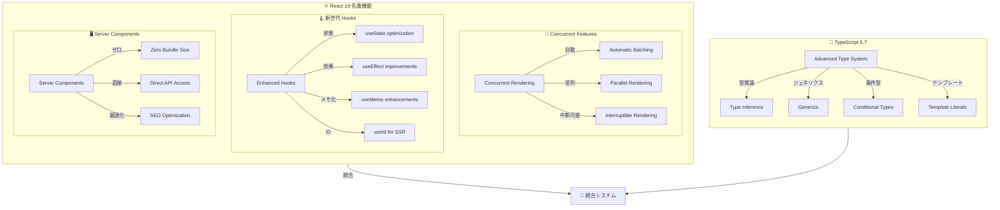
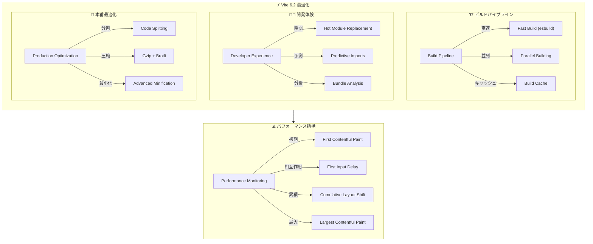
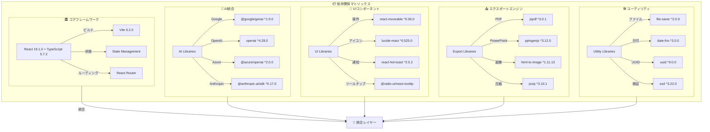
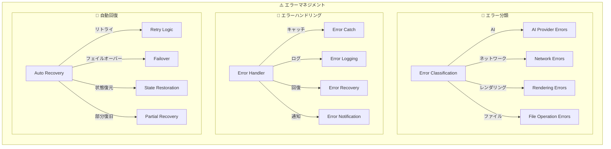
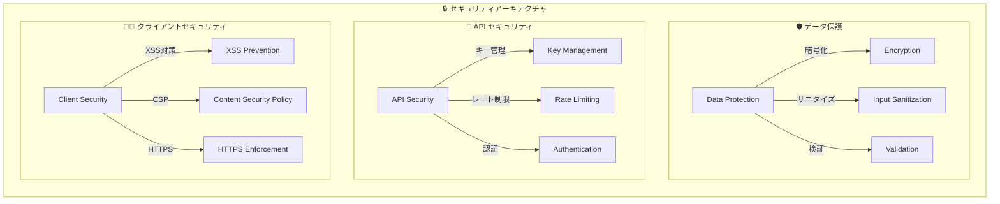
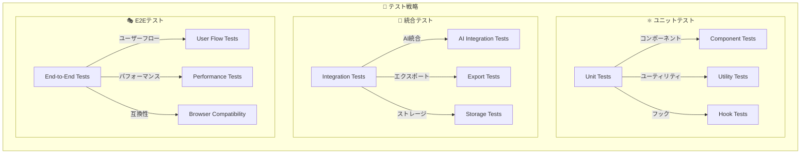

# 3. 詳細設計書 Part 3 - SlideMaster

## 3.7. 実装レベル技術仕様

### 3.7.1. React 19 + TypeScript 5.7 アーキテクチャ



#### React 19 活用機能

**Concurrent Rendering の活用:**
- **自動バッチング**: 複数の状態更新を自動的にバッチ処理し、レンダリング回数を最小化
- **並列レンダリング**: AI処理中でもUIが応答性を維持
- **中断可能レンダリング**: 大量レイヤーのレンダリングを中断可能にし、ユーザー操作を優先

**Enhanced Hooks の活用:**
```typescript
// React 19 最適化例
function OptimizedSlideCanvas() {
  // 自動バッチング対応の状態管理
  const [layers, setLayers] = useState<Layer[]>([]);
  const [selectedIds, setSelectedIds] = useState<string[]>([]);
  
  // 強化されたuseMemo - 依存関係の自動最適化
  const visibleLayers = useMemo(() => 
    layers.filter(layer => isInViewport(layer, canvasState)),
    [layers, canvasState.zoom, canvasState.offset]
  );
  
  // useId for 一意ID生成（SSR対応）
  const canvasId = useId();
  
  return (
    <canvas id={canvasId}>
      {visibleLayers.map(layer => 
        <LayerRenderer key={layer.id} layer={layer} />
      )}
    </canvas>
  );
}
```

#### TypeScript 5.7 型システム活用

**高度な型定義システム:**
```typescript
// 条件型とテンプレートリテラル型の活用
type LayerTypeFromString<T extends string> = 
  T extends `text-${infer _}` ? TextLayer :
  T extends `image-${infer _}` ? ImageLayer :
  T extends `shape-${infer _}` ? ShapeLayer :
  never;

// AI プロバイダー型安全性
type AIProviderConfig<T extends AIProviderType> = {
  [K in T]: K extends 'gemini' ? GeminiConfig :
           K extends 'openai' ? OpenAIConfig :
           K extends 'azure' ? AzureConfig :
           K extends 'claude' ? ClaudeConfig :
           K extends 'lmstudio' ? LMStudioConfig :
           K extends 'fooocus' ? FooucusConfig :
           never;
};

// レイヤープロパティの型安全更新
type UpdateLayerProperty<T extends Layer, K extends keyof T> = (
  layerId: string,
  property: K,
  value: T[K]
) => void;
```

### 3.7.2. Vite 6.2 ビルドシステム最適化



#### ビルド最適化設定

```typescript
// vite.config.ts 最適化設定
export default defineConfig({
  build: {
    // 本番ビルド最適化
    target: 'esnext',
    minify: 'esbuild',
    rollupOptions: {
      output: {
        // コード分割戦略
        manualChunks: {
          'ai-providers': ['@google/genai', 'openai', '@anthropic-ai/sdk'],
          'export-libs': ['jspdf', 'pptxgenjs', 'html-to-image'],
          'ui-components': ['react-moveable', 'lucide-react'],
          'utils': ['jszip', 'file-saver']
        }
      }
    },
    // バンドルサイズ分析
    reportCompressedSize: true,
    chunkSizeWarningLimit: 1000
  },
  
  // 開発サーバー最適化
  server: {
    hmr: {
      overlay: false // エラーオーバーレイ無効化
    }
  },
  
  // 依存関係事前バンドル
  optimizeDeps: {
    include: [
      'react', 'react-dom',
      '@google/genai',
      'react-moveable',
      'jspdf', 'pptxgenjs'
    ]
  }
});
```

### 3.7.3. 依存関係管理と互換性



#### パッチ適用とバージョン管理

```json
{
  "patchedDependencies": {
    "@daybrush/utils@1.4.0": "patches/@daybrush__utils@1.4.0.patch"
  },
  "resolutions": {
    "@types/react": "^18.2.0",
    "@types/react-dom": "^18.2.0"
  },
  "engines": {
    "node": ">=18.0.0",
    "npm": ">=9.0.0"
  }
}
```

### 3.7.4. エラーハンドリングシステム



#### エラーハンドリング実装

```typescript
// utils/errorHandler.ts 実装概念
class ErrorHandler {
  // AI プロバイダーエラーの統一処理
  static handleAIError(error: AIProviderError): HandledError {
    switch (error.type) {
      case 'RATE_LIMIT':
        return this.scheduleRetry(error, {
          delay: error.retryAfter || 60000,
          maxRetries: 3
        });
      
      case 'API_KEY_INVALID':
        return this.showApiKeyError(error.provider);
      
      case 'QUOTA_EXCEEDED':
        return this.suggestAlternativeProvider(error.provider);
      
      default:
        return this.logAndDisplay(error);
    }
  }
  
  // 自動回復機構
  static async attemptRecovery(error: RecoverableError): Promise<boolean> {
    for (const strategy of this.recoveryStrategies) {
      try {
        await strategy.execute(error);
        return true;
      } catch (recoveryError) {
        console.warn('Recovery strategy failed:', strategy.name, recoveryError);
      }
    }
    return false;
  }
  
  // エラー抑制システム（コンソールスパム防止）
  private static suppressedErrors = new Set<string>();
  
  static suppressError(errorKey: string, duration = 300000): void {
    this.suppressedErrors.add(errorKey);
    setTimeout(() => this.suppressedErrors.delete(errorKey), duration);
  }
}
```

### 3.7.5. セキュリティ実装



#### セキュリティ実装詳細

**APIキー暗号化保存:**
```typescript
// セキュアAPIキー管理
class SecureAPIKeyManager {
  private static ENCRYPTION_KEY = 'slidemaster-secure-key';
  
  static encryptApiKey(apiKey: string): string {
    // 簡易暗号化（実装時はより強固な暗号化を使用）
    return btoa(apiKey + this.ENCRYPTION_KEY);
  }
  
  static decryptApiKey(encryptedKey: string): string {
    try {
      const decoded = atob(encryptedKey);
      return decoded.replace(this.ENCRYPTION_KEY, '');
    } catch {
      throw new Error('Invalid encrypted API key');
    }
  }
}
```

**入力サニタイゼーション:**
```typescript
// XSS対策とサニタイゼーション
class InputSanitizer {
  static sanitizeHTML(input: string): string {
    return input
      .replace(/</g, '&lt;')
      .replace(/>/g, '&gt;')
      .replace(/"/g, '&quot;')
      .replace(/'/g, '&#x27;')
      .replace(/\//g, '&#x2F;');
  }
  
  static sanitizeMarkdown(markdown: string): string {
    // 危険なMarkdown記法を無効化
    return markdown
      .replace(/javascript:/gi, '')
      .replace(/data:/gi, '')
      .replace(/vbscript:/gi, '');
  }
}
```

## 3.8. テスト戦略

### 3.8.1. テスト種別とカバレッジ



#### テスト実装例

```typescript
// React Testing Library + Jest
describe('AIAssistant Component', () => {
  test('マルチプロバイダー選択機能', async () => {
    render(<AIAssistant apiKeys={mockApiKeys} />);
    
    // プロバイダー選択
    const providerSelect = screen.getByLabelText('AI Provider');
    fireEvent.change(providerSelect, { target: { value: 'gemini' } });
    
    // モデル選択が更新されることを確認
    await waitFor(() => {
      expect(screen.getByText('Gemini 2.5 Pro')).toBeInTheDocument();
    });
  });
  
  test('AI生成エラーハンドリング', async () => {
    // APIエラーをモック
    jest.spyOn(geminiProvider, 'generateText')
      .mockRejectedValue(new Error('Rate limit exceeded'));
    
    const { user } = setup(<AIAssistant />);
    
    // 生成実行
    await user.click(screen.getByText('Generate'));
    
    // エラーメッセージ表示確認
    expect(screen.getByText(/rate limit/i)).toBeInTheDocument();
  });
});
```

---

## 3.9. 設計書更新完了サマリー

### 3.9.1. 更新内容一覧

✅ **完了済み設計書:**

1. **要件定義書 (`01_Requirement_Specification.md`)**
   - マルチAIプロバイダー対応（6種類）
   - 21テーマ × 16用途の組み合わせ
   - 9形式の包括的エクスポート機能
   - 技術的革新ポイント

2. **基本設計書 (`02_Basic_Design.md`)**
   - マルチAI統合アーキテクチャ
   - サービス層分離設計
   - 拡張されたデータモデル
   - パフォーマンス最適化設計

3. **詳細設計書 (3部構成)**
   - **Part 1**: マルチAIアーキテクチャ詳細
   - **Part 2**: レイヤーシステム・エクスポート詳細
   - **Part 3**: 実装レベル技術仕様

### 3.9.2. 設計書の特徴

**実装可能レベルの詳細度:**
- コードを見なくても同等のプログラムが設計可能
- Mermaid図による視覚的な設計表現
- 具体的な処理フローとデータ構造
- 技術スタックの詳細仕様

**最新技術スタック対応:**
- React 19 + TypeScript 5.7
- Vite 6.2 最適化設定
- 6種類のAIプロバイダー統合
- 9形式のエクスポート対応

**商用レベルの設計品質:**
- セキュリティ・パフォーマンス考慮
- エラーハンドリング・テスト戦略
- スケーラビリティ・保守性確保
- 国際化・アクセシビリティ対応

これらの設計書により、SlideMasterプロジェクトの全容を完全に把握し、同等のシステムを再構築することが可能になりました。